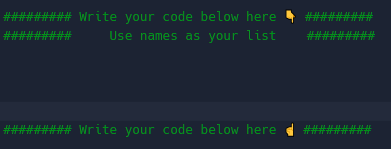
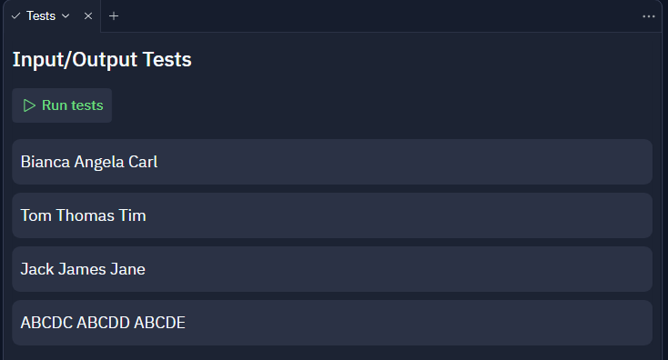
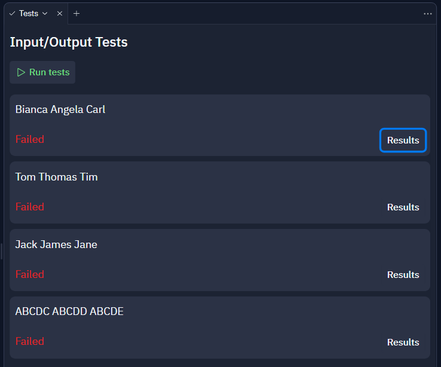

# Instructions  

  1. Write a program that takes in 3 names and adds these 3 names to a List.
  2. You will always be provided with 3 names separated by a new line
  3. Sort the List in descending order of the names and print out the List.
  4. Use the template provided in `main.py` and write code only in the indicated portion
   
  6. Examples are given below.

## Example Input and Output

### Example 1
#### Example Input #1
```python
Bianca
Angela
Carl
```

#### Example Output #1
```bash
['Carl', 'Bianca', 'Angela']
```

### Example 2
#### Example Input #2
```python
Thomas
Tim 
Tom
```

#### Example Output #2
```python
['Tom', 'Tim', 'Thomas']
```

## Testing your code
### To test your code, click on the `Tests` under Tools

### In the Tests section, run the tests against your code to see if your code is correct

### If your code passes all the tests, this is what you should see

### If your code fails any of the tests cases, you can click on `Results` to see why



- Note that even if you pass all test cases, your code might not be entirely correct!
- Once you think your code is correct, you can press the submit button on the top right hand corner
 
  
## Hint
  1. You will need to make use of some of the List methods introduced in class!
  2. You can find out more about List methods [here](https://www.w3schools.com/python/python_ref_list.asp)
  3. Break the problem down into steps
     - First you need to get the three input string and add it to the list
     - Then you need to sort the list
     - Finally you can print the sorted list
  4. Sort the names (string) in descending order; If the first characters are the same, sort based on the 2nd character of the string. If the second characters are the same, sort based on the 3rd character, so on and so forth
